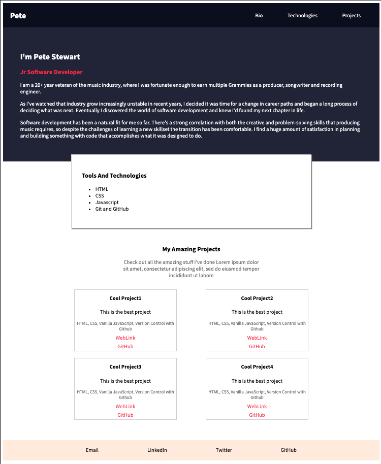

# Personal Bio Site

This web site is a work in progress meant to eventually display my projects created and skills developed during my time enrolled at [Nashville Software School](http://nashvillesoftwareschool.com/).

Currently it is merely a rough outline with minimal styling and content.

## Screenshot

## Contributors
* [Pete Stewart](https://github.com/petestewart72)

## Technologies Used
  

### Backlog
- [ ] Improve CSS stylization/appearance of page
- [ ] Fill with content as my skills are developed
